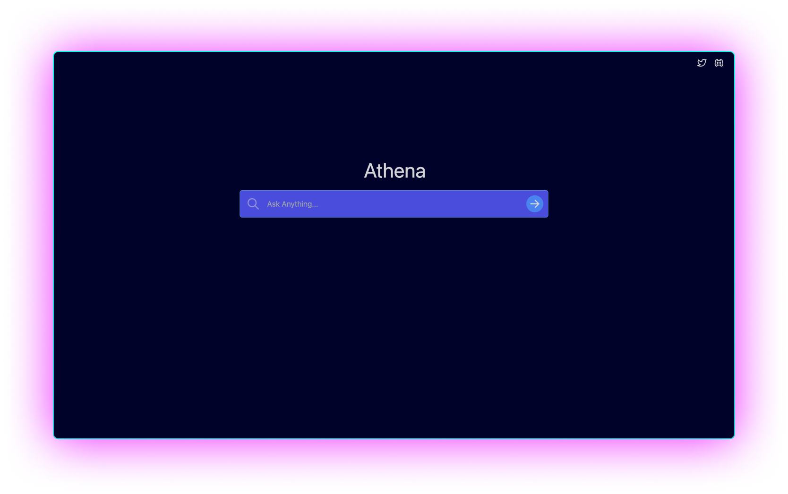
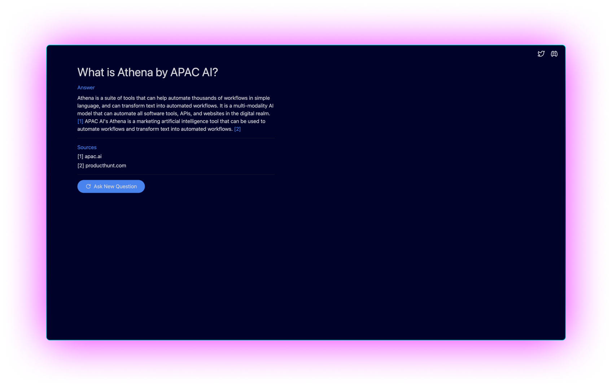

# Athena for Search: The Dawning of a New Era in Search






Athena for search is a free, open-source, and high performance alternative to Perplexity AI. Our priority lays in providing you with reliable Multi-Modal LLM backed search. Get started below or visit [search.apac.ai](https://search.apac.ai/)

## Usage
1. Clone the repository
    ```
    git clone https://github.com/kyegomez/Athena-for-Search.git
    ```
2. Install the dependencies.
    ```
    npm i
    ```

3. **Set Up Environment Variables**

   Athena uses environment variables to handle sensitive information such as API keys. You'll need to create a `.env` file in the root directory of the project:

   ```bash
   touch .env
   ```

   Next, open the `.env` file in your text editor and add the following lines:

   ```
   ATHENA_API_KEY=<Your OpenAI Key>
   GOOGLE_SEARCH_ENGINE_ID=<Your Google Custom Search Engine ID>
   GOOGLE_API_KEY=<Your Google Custom Search API Key>
   ```

   Fill in the placeholder fields with your actual keys. For instance, if your OpenAI Key is "1234abcd", your `.env` file will look like this:

   ```
   ATHENA_API_KEY=1234abcd
   GOOGLE_SEARCH_ENGINE_ID=<Your Google Custom Search Engine ID>
   GOOGLE_API_KEY=<Your Google Custom Search API Key>
   ```

   Save the file and exit the text editor.

4. **Run Athena**

   Now you're ready to run Athena:

   ```bash
   npm start
   ```

   Athena should now be running on your localhost!


4. Invoke Athena.
    ```
    npm run dev
    ```


## 🛠️ Environment Variables

Environment variables are a fundamental part of developing with Athena, as they allow you to switch behaviors and modes (such as switching between development and production) and keep your secret keys safe. Below are the environment variables used in Athena:

- `ATHENA_API_KEY`: Your OpenAI API Key. This is used to make requests to the OpenAI API. You can get this key from the OpenAI Dashboard.

- `GOOGLE_SEARCH_ENGINE_ID`: Your Google Custom Search Engine ID. This ID is necessary to create custom search results from Google. You can get this ID by setting up a Custom Search Engine in the Google Developers Console.

- `GOOGLE_API_KEY`: Your Google Custom Search API Key. This key is used to authenticate your application and authorize API requests. You can get this key from the Google Developers Console.

Remember to never commit your `.env` file or any other files containing your secret keys to version control. This is considered bad practice and may compromise the security of your application.

# Our Journey to the Future
Athena is not stagnant; she is an ever-evolving entity. We chart our course forward, guided by the stars of innovation and utility.

# Roadmap
Athena is a living entity, always in a state of growth, evolving and adapting to better serve humanity's pursuit of knowledge. We constantly strive to improve, innovate, and enhance the capabilities of Athena, all the while pushing the boundaries of what's possible. Our roadmap charts our journey towards an ambitious vision of the future. 

## Immediate Actionables

1. **Increased Speed of Answers**: We will begin working on replacing webpage scraping with the Google Search API, Bing, or both. By leveraging search APIs, we can speed up Athena's answer generation significantly. This marks a move away from the earlier scraping method, which was used to sidestep cost and rate limitations.  

2. **Follow-Up Searches**: In order to provide more detailed, nuanced, and layered information, Athena will gain the ability to conduct "follow-up" searches based on the initial search results. This will enable users to delve deeper into subjects, allowing for more informed and comprehensive exploration.

3. **Prompt Enhancement**: We will work to improve the prompts used to call the OpenAI API. By crafting more precise and context-aware prompts, we will enable Athena to generate more accurate and relevant answers. Return graphs, data visualizations, and multi-modality queries

4. **Expanding Data Sources**: We aim to enable sourcing from non-text-davinci-003 models, increasing the diversity of information Athena can leverage. This will broaden the scope of possible answers, providing a more well-rounded response to user queries.

5. **Personalized Models**: A feature to help you choose your own models like CHATGPT or Clauda or Athena Native through an model searching marketplace. We plan to develop a system that allows users to train their personalized models for answer synthesis. This personalization will enable Athena to understand each user's unique needs and preferences, further enhancing the accuracy and relevance of the answers generated.

These immediate enhancements will provide significant improvements to Athena's performance and capabilities, making it an even more powerful tool for discovery and learning. As we press forward with these advancements, we eagerly anticipate the new horizons of possibility that they will open up.


# License 

## Creative Commons Disclaimer

This project is licensed under the Creative Commons Attribution-NonCommercial (CC BY-NC) license. By contributing to this project or using the provided code, you agree to the following terms:

- You are free to distribute, modify, and build upon this work for non-commercial purposes, as long as you give appropriate credit to the original creator(s).
- Any modifications or derivative works based on this project must also be shared under the same CC BY-NC license.
- Commercial use, sale, or incorporation of this project or its components into commercial products is strictly prohibited without obtaining explicit permission from the copyright holder(s).
